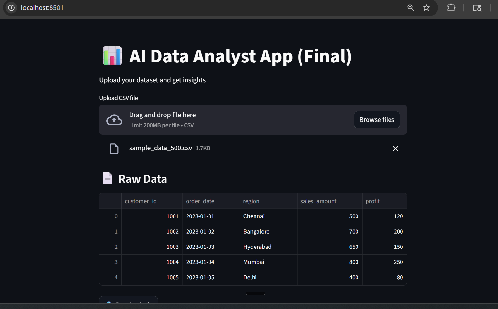
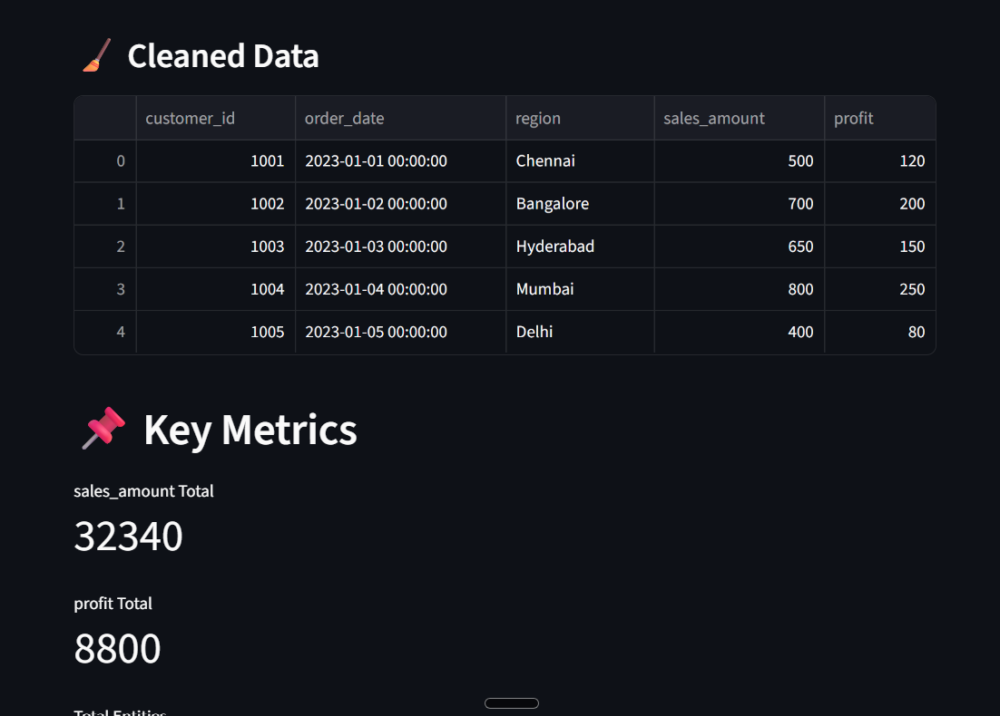
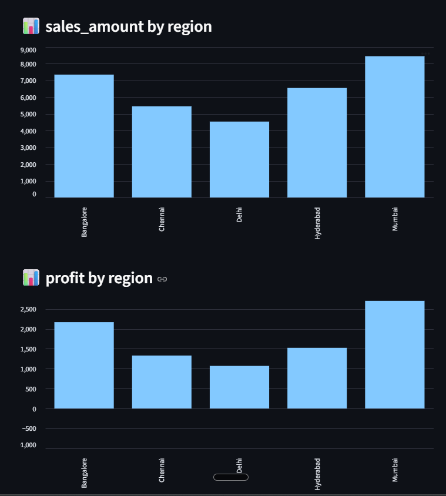
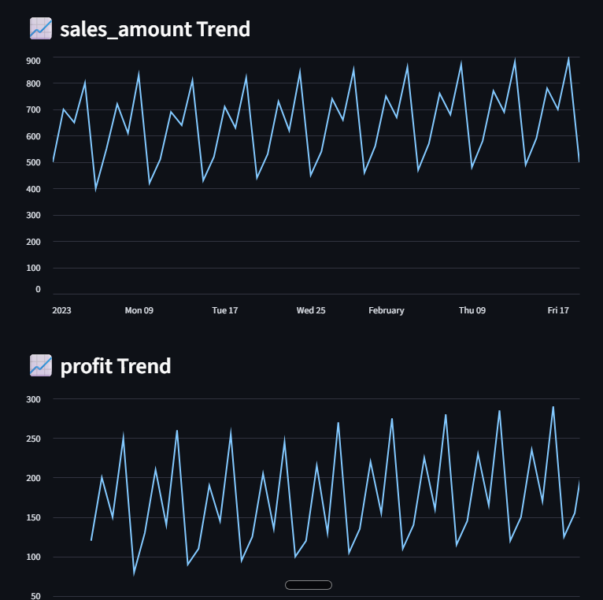
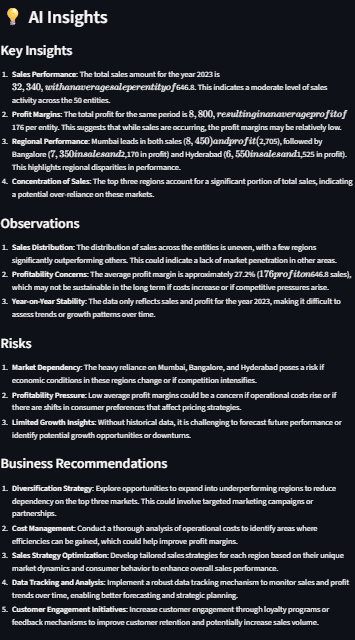

# ai-data-analyst-app
AI-powered data analysis app with automated cleaning, visualization, and GPT-based business insights using Streamlit.

\# 📊 AI Data Analyst App

An intelligent AI-powered data analysis tool that automatically cleans datasets, performs analysis, and generates business insights using GPT.
\---
\## 🚀 Features

\- Automatic data cleaning

\- Dynamic column detection (ID, date, numeric, categorical)

\- Outlier handling

\- KPI generation (sales, profit, etc.)

\- Data visualization (charts)

\- Time-series analysis

\- AI-generated business insights using OpenAI

\---

\## 📁 Project Structure
ai-data-analyst-app/
│
├── app.py
├── requirements.txt
├── README.md
│
├── data/
│ └── sample\_data.csv
│
├── notebooks/
│ └── analysis.ipynb
│
├── outputs/
│ ├── dashboard.png
│ └── insights.png

\---

\## 🛠️ Technologies Used

\- Python

\- Pandas

\- Streamlit

\- OpenAI API

\---

\## ▶️ How to Run

1\. Install dependencies:

pip install -r requirements.txt

2\. Run the app:

streamlit run app.py

\---

\## 📊 Sample Output

### Upload & Data Preview

### Cleaned Data

### Visualization

### AI Insights

\---

\## ⚠️ Limitations

\- Column detection is heuristic-based and may misclassify some fields

\- Large datasets (>50K rows) are sampled for performance

\- Requires OpenAI API key for generating insights

\- Encoding issues may occur with non-UTF-8 files

\---

\## 🚀 Future Improvements

\- Improved schema detection and validation

\- Chat with data (conversational interface)

\- Export reports (PDF/Excel)

\- Deployment to cloud (Streamlit Cloud)

\---

\## 👤 Author

Nivedhidha I

